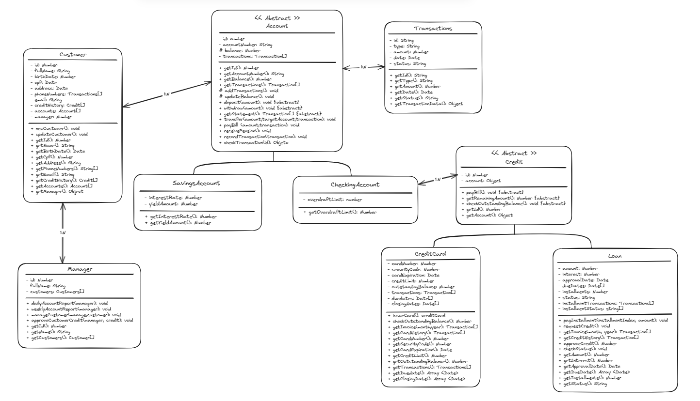

# Her Bank

## Visão Geral

Bem-vindo ao projeto do Banco Comunitário desenvolvido para a comunidade {Reprograma} para o curso de Imersão em JavaScript com foco em back-end e Nuvem AWS. Este projeto visa estabelecer um serviço financeiro comunitário focado em capacitar mulheres e apoiar diversas necessidades como reinserção profissional, apoio educacional para crianças, assistência para pessoas transgênero e tratamentos psicológicos.

### Serviços Oferecidos:

1. **Microcrédito para Empreendimentos Solidários**: Apoio financeiro para negócios e empreendimentos locais.
2. **Crédito Pessoal e Familiar sem Juros**: Crédito sem juros para necessidades pessoais e familiares.
3. **Cartão de Crédito Popular Solidário**: Cartão de crédito acessível para membros da comunidade.
4. **Serviços de Conta Corrente**: Abertura de conta, extratos, depósitos, saques e pagamento de contas.
5. **Recebimento de Aposentadorias e Pagamentos Governamentais**: Facilitação de pagamentos de aposentadorias e benefícios governamentais.
6. **Gerentes de Conta**: Gerentes dedicados para atendimento personalizado aos clientes.
7. **Relatórios de Prestação de Contas Diários e Semanais**: Transparência na prestação de contas financeiras para a comunidade.

## Estrutura das Classes

### Customer:

Representa um membro da comunidade utilizando os serviços do banco.

- **Atributos**:
  - id: Identificador único do cliente.
  - fullName: Nome do cliente.
  - birthDate: Data de nascimento do cliente.
  - cpf: CPF do cliente.
  - address: Endereço do cliente.
  - phoneNumber: Lista de números de telefone de contato do cliente.
  - email: Endereço de e-mail do cliente.
  - creditHistory: Array de objetos detalhando o histórico de créditos do cliente.
  - accounts: Lista de contas do cliente.
  - manager: Objeto representando os dados do gerente associado a este cliente.

- **Métodos**:
  - newCustomer(): Registra um novo cliente no sistema do banco.
  - updateCustomer(): Atualiza informações do cliente.

### Account:

Representa a conta corrente de um cliente.

- **Atributos**:
  - id: Identificador único da conta.
  - accountNumber: Número da conta.
  - balance: Saldo atual da conta.
  - transactions: Array de objetos representando as transações da conta.

- **Métodos**:
  - addTransactions(): Registra nova transação
  - updateBalance(): Atualiza salvo devedor.
  - openAccount(): Abre uma nova conta corrente para um cliente.
  - getStatement(): Retorna o extrato da conta.
  - deposit(): Realiza um depósito na conta.
  - withdraw(): Realiza um saque na conta.
  - payBill(): Paga uma conta utilizando fundos da conta.
  - receivePension(): Facilita o recebimento de aposentadorias na conta.
  - checkTransaction(): verifica transações.

- **Subclasses**:
  - CheckingAccount: Conta corrente para clientes.
  - **Atributos**:
  - overdraftLimit: limite de cheque especial.

  - SavingsAccount: Conta poupança para clientes.

  - **Atributos**:
  - interestRate: taxa de juros para rendimento.
  - yieldAmount: valor de rendimento.

### Credit:

Representa um crédito oferecido a um cliente.

- **Atributos**:
  - id: Identificador único do crédito.
  - account: conta atrelada ao crédito

- **Subclasses**

 - CreditCard: Representa um cartão de crédito associado a um cliente.

- **Atributos**:
  - cardNumber: Número do cartão de crédito.
  - securityCode: Código de segurança do cartão.
  - cardExpiration: Data de expiração do cartão.
  - creditLimit: Limite de crédito do cartão.
  - outstandingBalance: Saldo devedor do cartão.
  - transactions: Array de objetos representando as transações do cartão.
  - dueDates: Lista de datas de vencimento do cartão.
  - closingDates: Lista de datas de fechamento da fatura do cartão.

- **Métodos**:
  - issueCard(): Emite um novo cartão de crédito para o cliente.
  - checkOutstandingBalance(): Retorna o saldo devedor do cartão.
  - payBill(): Realiza o pagamento da fatura do cartão;
  - getInvoice(): Extrai fatura do cartão de crédito em um mês.
  - getCardHistory(): Extrai histórico do cartão.

  - Loan: Empréstimo vínculado à conta de um cliente.

  - **Atributos**:
  - amount: Montante do empréstimo.
  - interest: Taxa de juros do crédito.
  - approvalDate: Data de aprovação do crédito.
  - dueDates: Data de vencimento do crédito.
  - installments: Número de parcelas do empréstimo.
  - status: status do empréstimo.
  - transactions: Array de objetos relacionados ao crédito.
  - installmentTransactions: Lista das parcelas do empréstimo
  - installmentsStatus: Lista de status das parcelas.

- **Métodos**:
  - payInstallment(): Abate o valor do saldo devedor do empréstimo.
  - requestCredit(): Inicia uma solicitação de crédito.
  - approveCredit(): Aprova o crédito.
  - checkStatus(): Retorna o status atual da solicitação de crédito.
  - getInvoice(): Emite fatura do empréstimo.
  - getCreditHistory(): Emite o histórico de parcelas do empréstimo.
  - checkStatus(): Verifica o status do empréstimo.

### Transaction:

Representa uma transação financeira.

- **Atributos**:
  - id: Identificador único da transação.
  - type: Tipo de transação.
  - amount: Valor da transação.
  - date: Data da transação.
  - status: Status da transação.

- **Métodos**:
  - recordTransaction(): Registra uma transação no sistema.
  - checkTransaction(): Retorna objeto com detalhes de uma transação específica.

### Manager:

Representa um gerente responsável pelo atendimento aos clientes.

- **Atributos**:
  - id: Identificador único do gerente.
  - name: Nome do gerente.
  - customers: Array de Clientes que o gerente gerencia.

- **Métodos**:
  - dailyAccountReport(): Gera um relatório diário das contas.
  - weeklyAccountReport(): Gera um relatório semanal das contas.
  - manageCustomer(): Gerencia um cliente específico.
  - approveCustomerCredit(): Aprova o crédito de um cliente.

## Resumo das Relações

- **Customer** tem uma relação 1:1 com **Account**.
- **Customer** tem uma relação 1:N com **Credit**.
- **Customer** tem uma relação N:1 com **Manager**.
- **Account** tem uma relação 1:N com **Transactions**.
- **Crédito** tem uma relação 1:N com **Transactions**.
- **Customer** tem uma relação 1:N com **CreditCard**.
- **Manager** tem uma relação 1:N com **Customer**.

#### Desenvolvido por Maria Luiza Mourão